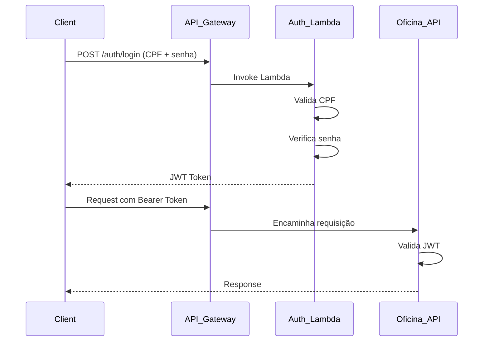

# Oficina API

## Sumário

- [Sobre o Projeto](#sobre-o-projeto)
- [Fluxos Principais](#fluxos-principais)
- [Documentação Técnica](#documentação-técnica)
- [Aspectos Técnicos](#aspectos-técnicos)
    - [Arquitetura](#arquitetura)
    - [Stack Tecnológica](#stack-tecnológica)
- [Requisitos](#requisitos)
- [Pipeline](#pipeline)
- [Executando o Projeto](#executando-o-projeto)
- [Swagger / OpenAPI](#swagger--openapi)
- [Autenticação](#autenticação)
- [Testes](#testes)
- [Deploy no Kubernetes](#deploy-no-kubernetes)
- [Observabilidade](#observabilidade)

## Sobre o Projeto

Sistema de gestão para oficinas mecânicas que automatiza o fluxo completo de atendimento, desde a entrada do veículo até a entrega ao cliente. A aplicação gerencia clientes, veículos, catálogos de serviços e produtos, orçamentos e ordens de serviço, oferecendo controle centralizado das operações da oficina.

### Links Úteis

- GitHub: https://github.com/soat13/oficina
- Miro: https://miro.com/app/board/uXjVJLyIcr8=

### Funcionalidades Principais

- **Gestão de Clientes e Veículos** — Cadastro e relacionamento entre clientes e seus automóveis
- **Catálogos** — Serviços técnicos e produtos com controle de estoque
- **Orçamentos** — Propostas com itens de serviço e produto, sujeitas à aprovação
- **Ordens de Serviço (OS)** — Fluxo completo: recepção, diagnóstico, aprovação, execução e liberação
- **Controle de Acesso** — Autenticação e autorização por perfis (Atendente, Mecânico, Gerente)
- **Eventos de Domínio** — Desacoplamento entre contextos (ex: baixa de estoque após aprovação)

A aplicação segue os princípios de **Domain-Driven Design (DDD)** e **Arquitetura Hexagonal**, com organização por contextos de domínio independentes.

## Fluxos Principais

- **Repair Order — fluxo end-to-end**  
  Fluxo operacional completo da Ordem de Serviço, da criação à entrega do veículo, com foco na ordem de chamadas dos endpoints e nas regras de negócio.  
  [`docs/repair-order-complete-flow.md`](docs/repair-order-complete-flow.md)

- **Diagrama de sequência — fluxo de negócio**  
  Visão macro da interação entre Client, API Gateway, Lambda de autenticação e os módulos internos da aplicação ao longo do fluxo operacional da oficina.  
  [`docs/sequence-diagram.md`](docs/sequence-diagram.md)

> Payloads, schemas e exemplos de request/response estão documentados no **Swagger/OpenAPI**.  
> Os documentos em `docs/` focam no fluxo operacional e na visão arquitetural das interações.

## Documentação Técnica

- Glossário de domínio (termos, roles e status): [`docs/domain-glossary.md`](docs/domain-glossary.md)
- Arquitetura e decisões técnicas: [`docs/architecture.md`](docs/architecture.md)
- Modelo Entidade-Relacionamento (DER): [`docs/der.md`](docs/der.md)
- ADRs (Architecture Decision Records): [`docs/adr`](docs/adr)


## Aspectos Técnicos

A API é construída em **Go**, seguindo princípios de **DDD** e **Arquitetura Hexagonal**, organizada por contextos de domínio independentes.

### Arquitetura

O projeto adota **Arquitetura Hexagonal (Ports & Adapters)** combinada com **DDD**, organizado por contextos de domínio independentes.

Cada contexto é estruturado em:

- **Domain** (`domain/`) — Entidades, value objects e regras de negócio puras, sem dependências externas
- **Application** (`application/`) — Casos de uso que representam as operações do sistema (pontos de entrada) e ports (interfaces) para dependências externas
- **Infrastructure** (`infra/`) — Adapters concretos:
    - **Inbound**: handlers HTTP e listeners de eventos
    - **Outbound**: repositórios (Bun/Postgres), publicação de eventos, JWT e integrações externas

Os casos de uso são invocados por adapters de entrada e acessam recursos externos exclusivamente via **ports**, garantindo baixo acoplamento e inversão de dependência.

A comunicação entre contextos ocorre por **eventos de domínio**, publicados e consumidos através de um event bus em memória, preservando o desacoplamento entre bounded contexts.

Para detalhes completos da arquitetura e decisões técnicas, consulte: [`docs/architecture.md`](docs/architecture.md)

### Stack Tecnológica

- **Linguagem**: Go 1.25.1
- **Framework HTTP**: Fiber v2
- **ORM**: Bun
- **Migrações**: sql-migrate
- **Autenticação**: JWT (HS256)
- **Testes**: Go testing + testify
- **Containerização**: Docker + Docker Compose
- **Banco de Dados**: PostgreSQL — Escolhido por ser um SGBD relacional maduro e confiável, adequado para garantir integridade transacional em operações críticas como criação de Ordens de Serviço, aprovação de orçamentos e controle de estoque. O modelo relacional facilita a consistência entre entidades fortemente relacionadas e oferece suporte nativo a transações ACID, constraints e índices, essenciais para a confiabilidade e evolução do sistema.

## Requisitos

- Docker e Docker Compose
- make (opcional, recomendado)

## Pipeline

O projeto utiliza **GitHub Actions** para CI/CD automatizado com os seguintes jobs:

```
┌─────────────────────────────────────────────────────────────────────────────────────────────┐
│                      GitHub Actions - Aplicação (oficina)                                   │
│                                                                                             │
│  ┌──────────────┐    ┌──────────────┐    ┌──────────────┐    ┌──────────────┐               │
│  │   SonarCloud │──▶ │     Build    │───▶│     Push     │──▶ │   Deploy     │               │
│  │     Scan     │    │    Docker    │    │     ECR      │    │   K8s/EKS    │               │
│  └──────────────┘    └──────────────┘    └──────────────┘    └──────────────┘               │
│   • Security           • Tests              • Tag Image         • Apply Manifests           │
│   • Code Quality       • Coverage           • Amazon ECR        • Rolling Update            │
└─────────────────────────────────────────────────────────────────────────────────────────────┘
```
1. **tests-and-quality** — Testes unitários/integração + SonarCloud
2. **docker-build** — Build da imagem Docker
3. **deploy-to-ecr** — Push para Amazon ECR (apenas branch `main`)
4. **k8s-deploy** — Deploy automático no Kubernetes (EKS) aplicando os manifests localizados em `deploy/k8s/` (apenas branch `main`)
   - Obtém outputs do Terraform do estado armazenado no S3
   - Configura kubectl para conectar ao cluster EKS
   - Aplica todos os recursos Kubernetes necessários
   - Executa rolling update do deployment

## Executando o Projeto

### Com Make

1. Subir os containers:
    - `make install`
    - Caso não exista `.env`, ele será criado a partir do `.env-example`
2. Aplicar migrações:
    - `make migrate-up`
3. Rodar a API:
    - `make run`

### Sem Make

1. Criar o `.env` a partir do `.env-example`
2. Subir os containers:
    - `docker compose up -d`
3. Aplicar migrações:
    - `docker compose exec -T app-dev sh -lc 'test -x /go/bin/sql-migrate || GOBIN=/go/bin /usr/local/go/bin/go install github.com/rubenv/sql-migrate/sql-migrate@latest'`
    - `docker compose exec -T app-dev sh -lc '/go/bin/sql-migrate up -config=./scripts/db/dbconfig.yml -env=development'`
4. Rodar a API:
    - `docker compose exec app-dev go run ./cmd/api`

## Swagger / OpenAPI

- UI: http://localhost:8080/docs
- Spec: http://localhost:8080/openapi.yaml
- Arquivo no repositório: `assets/docs/openapi.yaml`

## Autenticação

A autenticação da plataforma utiliza **JWT** e, em ambiente de produção, é realizada através de uma **AWS Lambda dedicada**,
exposta pelo **API Gateway**.

- Login: `POST /auth/login`
- Header: `Authorization: Bearer <token>`

Fluxo:

1. O cliente envia CPF e senha para `/auth/login`
2. O **API Gateway** roteia a requisição para a **Lambda de autenticação**
3. A Lambda valida as credenciais e retorna um **JWT**
4. O token deve ser enviado no header `Authorization` para acessar rotas protegidas da Oficina API

### Ambiente não produtivo

Para facilitar desenvolvimento local e execução de testes automatizados, o endpoint `POST /auth/login` **continua existindo dentro da Oficina API**, porém **apenas em ambientes não produtivos**.

Uma verificação no código garante que esse endpoint só seja habilitado quando a aplicação não está rodando em produção.

Em ambiente de produção, o login ocorre exclusivamente através da **AWS Lambda exposta pelo API Gateway**.

### Fluxo de Autenticação


> Para uma visão completa do fluxo da aplicação,  incluindo CRUDs administrativos, ciclo de vida da Repair Order, 
> validação de estoque e execução do serviço - consulte o diagrama detalhado em [`docs/sequence-diagram.md`](docs/sequence-diagram.md).

## Testes

- `make test` — executa testes unitários e de integração
- `make test-coverage` — gera relatório de cobertura
- `make sonar` — executa análise no SonarQube

> Os testes de integração criam bancos isolados e aplicam migrações automaticamente

## Deploy no Kubernetes

A aplicação é deployada automaticamente no **Amazon EKS** através do pipeline CI/CD. Os manifests Kubernetes estão localizados em `deploy/k8s/`:

### Manifests Disponíveis

- **namespace.yaml** — Cria o namespace `fiap` para isolamento dos recursos
- **serviceaccount.yaml** — Service account para o pod da aplicação
- **configmap.yaml** — Configurações não sensíveis (MIGRATIONS_DIR, PORT)
- **secrets.yaml** — Dados sensíveis (JWT_SECRET, credenciais do PostgreSQL, PG_DSN)
- **app.yaml** — Deployment da aplicação com 2 réplicas iniciais
- **services.yaml** — Service do tipo LoadBalancer expondo a aplicação externamente na porta 3000
- **hpa.yaml** — Horizontal Pod Autoscaler configurado para escalar de 1 a 10 réplicas baseado em CPU (target: 50%)
- **metric-server.yaml** — Metrics Server necessário para o HPA funcionar corretamente

## Observabilidade

A aplicação é instrumentada com **Datadog APM** para observabilidade. A integração inclui:

- **Traces** — Rastreamento distribuído de requisições HTTP via middleware do Fiber
- **Métricas customizadas** — Métricas de negócio enviadas via DogStatsD (ex: contagem de orçamentos, OS criadas)
- **Middleware HTTP** — Captura automática de latência, status code e rotas de cada request
- **Profiling** — Coleta contínua de dados de performance da aplicação Go
