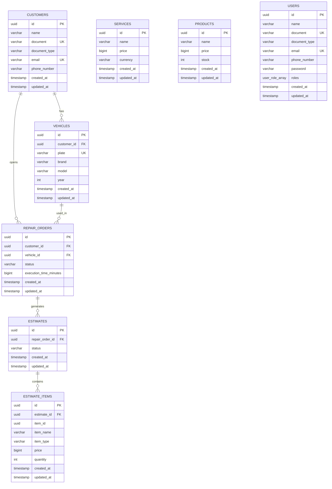

DER - Modelo de Dados

Este diagrama representa a estrutura final do banco PostgreSQL, considerando todas as migrations aplicadas.

A modelagem reflete o fluxo completo da oficina:
```
Cliente → Veículo
Cliente/Veículo → Ordem de Serviço
Ordem de Serviço → Orçamento
Orçamento → Itens (Serviços ou Produtos)
```

> **Nota:** Este diagrama está em formato Mermaid. Dependendo da plataforma, ele pode ser exibido como diagrama visual ou apenas como bloco de código.
