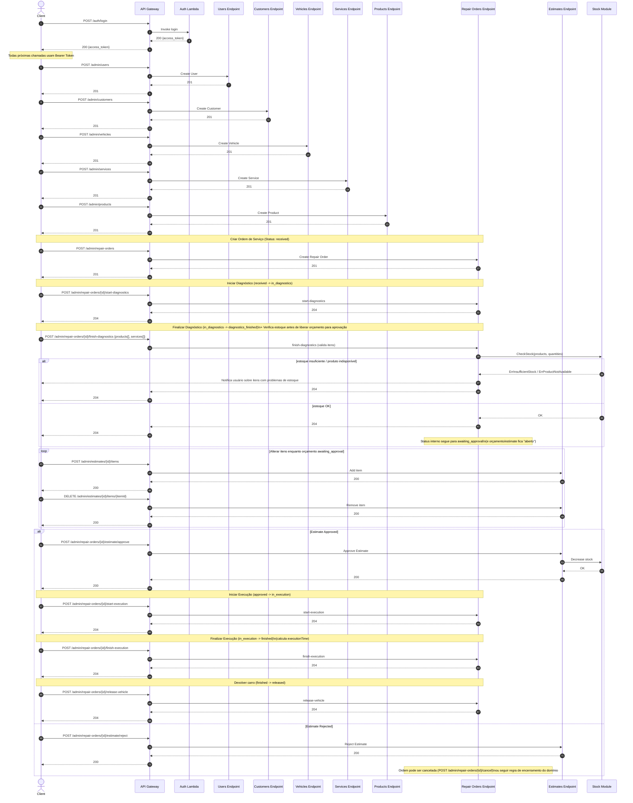

Diagrama de Sequência - Fluxo de Negócio

Este diagrama representa o fluxo completo de interação entre o cliente, API Gateway, Lambda de autenticação e os módulos internos da aplicação, considerando os endpoints expostos pela Oficina API.

A modelagem reflete o fluxo operacional da oficina:

```text
Autenticação → CRUDs Administrativos → Ordem de Serviço
Ordem de Serviço → Diagnóstico → Verificação de Estoque
Ordem de Serviço → Aprovação/Rejeição do Orçamento
Aprovação → Execução → Finalização → Liberação do Veículo
```

O diagrama demonstra:

- Interação entre Client, API Gateway e Lambda de Autenticação
- Chamadas para os endpoints administrativos (/admin/...)
- Transições de status da entidade RepairOrder
- Validações de estoque durante o processo de diagnóstico
- Aprovação ou rejeição do orçamento
- Processo completo até a devolução do veículo

> Nota 1: Este diagrama está em formato Mermaid. Dependendo da plataforma, ele pode ser exibido como diagrama visual ou apenas como bloco de código.

> Nota 2: O diagrama representa o fluxo conceitual da aplicação. Camadas internas como UseCases, Repositórios, Transações e Validações de Domínio podem estar abstraídas para simplificação visual.

> Nota 3: As respostas HTTP (204, 200, 201, 422 etc.) refletem o comportamento atual dos handlers implementados, podendo evoluir conforme as regras de negócio sejam ajustadas.

